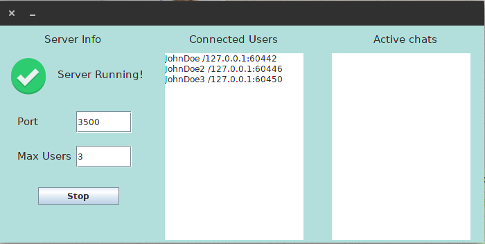
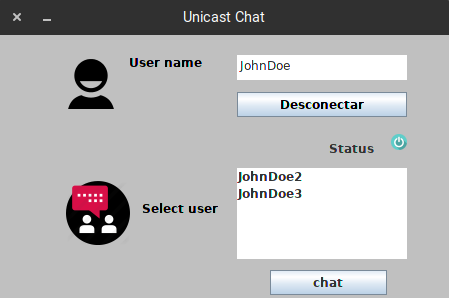
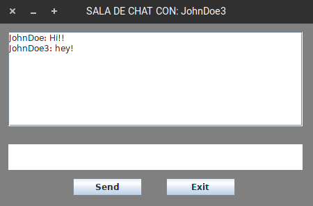

# UnicastSocketsChat
Server and Client chat made with unicast sockets in Java.

## Server   	
- View and Handle connected users and actual chats.
- Start and stop the service.
- Define the port of the service.
- Connected clients in real time.
- Max users and active chats are no working.

   		
## Client
First of all you have to connect to the server, with a nickname. Then, the 
server will return a list with all the connected users. This users will be 
displayeds in a realtime list in the client GUI.

Now you can select an user of the list of connected users and click to "chat"
to open a new window to you and the other users with the chat GUI.

If you close the chat, the other user see a text saying that you're disconnected.

You can chat with more than one user at the same time.
